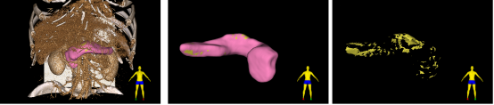

# nnTransfer Readme

# Automated Pancreas Segmentation and Fat Fraction Evaluation Basing a Self-Supervised Transfer Learning Network

---
This code repository provides a network for pancreatic segmentation in abdominal CT scans. The weights of the segmentation network are not randomly initialized but learned from unlabeled abdominal CT images using self-supervised learning. Furthermore, it calculates the infiltration ratio of pancreatic fat.

<p align="center"></p>

The segmentation and infiltration of fat in one of our cases. In this case, the fat volume was 89.99ml and the fat infiltration percentage was 9.1%

<p align="center"></p>

# Paper

---

# Installation

---

Experimental Setup: The experiment was conducted using Python 3.9 on a Rocky 8.7 system.You can refer to the environment configuration file `environment.yml`

---

# **Code Repository Features**

Based on the functionality of the code repository, it can be divided into three parts.

- • Self-supervised learning network
- • Segmentation network
- • Evaluation metrics and calculation of fat infiltration ratio

### Segmentation network：

`infinite_generator_3D.py` ：Used to generate cubic blocks around the pancreas in abdominal CT scans, with a size of 32×64×64.

```
for subset in `seq 0 9`do
python -W ignore infinite_generator_3D.py \
--fold $subset \
--scale 32 \
--data yourdataset \
--save generated_cubes
done
```

`Self supervised training` : Train the data generated by `infinite_generator_3D` using a segmentation network.

"If you are interested in this self-supervised network and want to apply it to your own dataset, you can refer to“[ModelsGenesis/pytorch at master · MrGiovanni/ModelsGenesis (github.com)](https://github.com/MrGiovanni/ModelsGenesis/tree/master/pytorch)”

Download the initial weights for self-supervised training: ……

### Segmentation network：

……

### Evaluation metrics and calculation of fat infiltration ratio：

`Dice_evaluate.py` : The Dice coefficient, HD95, Jaccard index, Precision, and Sensitivity are used to calculate the agreement between the true values and predicted labels.

`Volume_pancreas.py` : It is used to calculate the volume of the pancreas as well as the fat infiltration ratio, and ultimately generate a pancreatic fat map. 

**Note**: The calculation of fat infiltration here must be based on CT scan images. If only labels from the portal venous phase are available, registration must be performed before the calculation.

